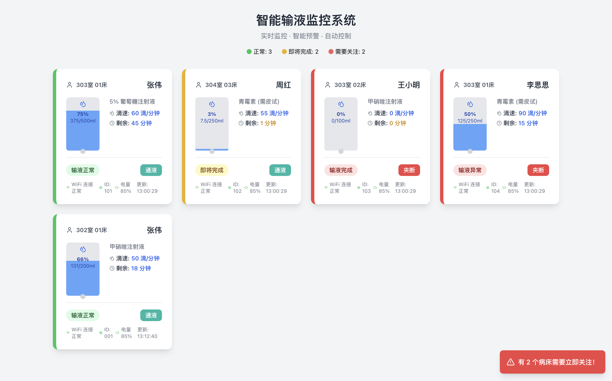

# FusionFlow · Dual-sensor infusion monitoring

[中文](README.md) · [Algorithm design](docs/architecture.md) · [Build notes](docs/build.md)

A personal ESP32-S3 project for estimating liquid flow, remaining mass, and weight per drop from a load cell and an optical drip sensor. The C++ implementation includes a three-state mass estimator, a two-state drip-rate estimator, scalar weight-per-drop calibration, and sequential fusion of flow and remaining-mass estimates.

Author: Haowen Zheng (Owen). The project is intended for sensor research and bench demonstrations.

## Demonstration

<p align="center">
  
</p>

The monitoring interface presents device status, liquid quantity, drip rate, and estimated remaining time.

https://github.com/user-attachments/assets/89d09ea9-4cbe-42cc-89d2-e86c948f0297

[Repository video](docs/images/demo.mp4)

## Technical overview

| Area | Implementation |
| --- | --- |
| Embedded software | C++, ESP32-S3, Arduino, PlatformIO, hardware and processing interfaces. |
| State estimation | Linear Kalman filters; mass/derivative states and sequential scalar measurement updates. |
| Sensors | HX711 load cell, optical drip events, weight-per-drop calibration. |
| Interaction | OLED, GPIO interrupts, buttons, NeoPixel status indication. |
| Visualization | HTTP/WebSocket interfaces, ArduinoJson, React, Axios, Tailwind CSS. |
| Analysis | Python collection/analysis scripts and native / Unity test directories. |

### Estimation pipeline

`WeightKalmanFilter` tracks `[mass, mass derivative, second derivative]` using a constant-acceleration transition and actual sample interval. `DripKalmanFilter` tracks drip rate and its derivative; a separate calibration method observes cumulative mass loss divided by cumulative drop count.

`DataFusion` maintains two scalar filters, one for mass flow and one for remaining mass. Each receives sequential observations from the weight and drip paths. Remaining-mass prediction uses the previous flow estimate. The paths share weight information through calibration, so their error correlation is a relevant part of evaluating the fusion model.

[Algorithm and system notes](docs/architecture.md) describe the implemented matrices, calibration gates, noise parameterization, and interface assumptions. [Validation notes](docs/validation.md) identify numerical and integration checks, including a process-covariance issue in the example configuration.

## Existing analysis figures

The repository includes flow, mass, weight-per-drop, and remaining-time plots. They are preserved as project records; quantitative interpretation requires the corresponding data and measurement protocol.


<details>
<summary>Weight-per-drop comparison</summary>


</details>

## Getting started

```sh
git clone https://github.com/Owen1B/FusionFlow.git
cd FusionFlow/server/frontend
npm ci
HOST=127.0.0.1 npx --no-install react-scripts start
```

These commands describe the local POSIX-shell frontend entry point; execution remains to be verified in the target development environment. The page requests `/api/patients` every three seconds and requires a compatible API service. The development proxy points to `http://localhost:5000`.

For firmware, use the `esp32-s3-devkitc-1` environment in `platformio.ini`. The current source tree still requires the implementations declared by `HardwareManager.h` and `SensorDataProcessor.h` for a complete device build. See [build notes](docs/build.md) for hardware configuration, native tests, and integration requirements.

## Source map

- [`src/`](src/): filter implementations, state manager, and application entry point.
- [`include/`](include/): filter classes, configuration, hardware and processing interfaces.
- [`server/frontend/`](server/frontend/): API-driven React frontend.
- [`test/`](test/) and [`scripts/`](scripts/): tests, historical code, collection and analysis material.

## Scope and attribution

Use this project for bench experiments only. It must not be used to control human infusions. Accuracy, timing, and fault response require independent measurements under specified conditions.

Project terms are in [LICENSE](LICENSE); dependency and media details are in [attribution](docs/attribution.md). The linked technical documents are in Chinese.
