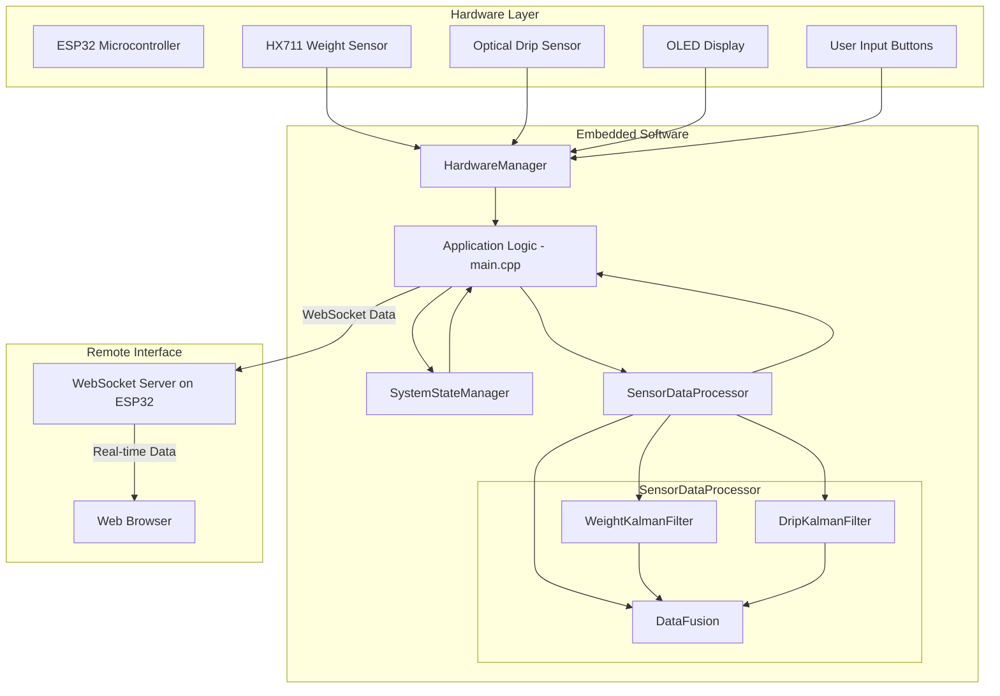

# Smart Infusion Monitoring System

[](https://www.espressif.com/en/products/socs/esp32)
[](https://www.arduino.cc/)
[](https://isocpp.org/)
[](https://opensource.org/licenses/MIT)

An embedded system for real-time, high-precision monitoring of medical infusions, utilizing a dual-sensor fusion approach with Kalman filtering algorithms. This project is developed for the ESP32 platform using C++ and PlatformIO.

## Table of Contents
- [Overview](#overview)
- [Features](#features)
- [Technology Stack](#technology-stack)
- [Demo](#demo)
- [System Architecture](#system-architecture)
- [Algorithm Design](#algorithm-design)
- [Getting Started](#getting-started)
- [Code Structure](#code-structure)
- [License](#license)

## Overview

Traditional infusion monitoring often relies on manual checks or simple drop counters, which can be imprecise and lack real-time feedback. This project addresses these limitations by implementing a sophisticated monitoring system that fuses data from two distinct sensor types: a weight sensor and an optical drip counter.

The core of the system is a set of cascaded Kalman filters that process noisy sensor readings to produce a stable and accurate estimation of the infusion flow rate and remaining volume. The system provides real-time data locally on an OLED display and remotely through a web interface, demonstrating a complete end-to-end IoT solution.

## Features

- **Dual-Sensor Data Fusion**: Combines readings from an HX711 weight sensor and an optical drip sensor for enhanced accuracy and robustness.
- **Advanced Signal Processing**: Implements multiple Kalman filters to effectively reduce sensor noise and estimate key state variables (flow rate, volume, etc.).
- **Auto-Calibration**: Features an online calibration algorithm for the weight-per-drop (WPD) parameter, adapting to different infusion sets and liquid properties.
- **Real-time Monitoring**: Provides immediate feedback via a local OLED display and a web-based dashboard accessible over WiFi.
- **Modular Architecture**: Built with a clean, layered software architecture (Hardware Abstraction Layer, System State Manager, Data Processor) for maintainability and testability.
- **End-to-End Solution**: Includes the embedded firmware, a web server for remote monitoring, and Python scripts for data analysis and filter tuning.

## Technology Stack

### Hardware
* **Microcontroller**: ESP32-S3
* **Weight Sensing**: 5kg Load Cell with HX711 ADC Module
* **Drip Counting**: Infrared (IR) Optical Drip Sensor
* **Display**: SSD1306 OLED Display (128x64)
* **User Interface**: Push Buttons & WS2812B RGB LED

### Software & Firmware
* **Programming Language**: C++
* **Main Framework**: Arduino
* **Build System**: PlatformIO
* **Real-time Communication**: WebSockets
* **Data Serialization**: ArduinoJson

### Backend & Frontend
* **Backend**: Node.js, Express.js
* **Frontend**: React
* **Data Visualization**: Chart.js (or similar)

### Data Analysis & Simulation
* **Language**: Python
* **Tools**: Jupyter Notebook, NumPy, Matplotlib

## Demo

### Web Monitoring Interface
The following image shows the web dashboard, which displays real-time data for multiple infusion devices, including current status, flow rate, and estimated remaining time.


### System Demonstration Video
A complete demonstration of the system in operation, from setup to real-time monitoring and alert handling.

https://github.com/user-attachments/assets/89d09ea9-4cbe-42cc-89d2-e86c948f0297

## System Architecture

The system is composed of a hardware layer, an embedded software layer, and a remote monitoring interface. The architecture is designed to be modular and scalable.



## Algorithm Design

The system's precision relies on a multi-stage filtering process:

1.  **`WeightKalmanFilter`**: A 3-state Kalman filter (`[weight, velocity, acceleration]`) processes the raw weight data. It smooths the readings and provides a primary flow rate estimation based on the rate of weight change (velocity).
2.  **`DripKalmanFilter`**: A more complex module containing two filters:
    *   A 2-state Kalman filter (`[drip_rate, drip_acceleration]`) smooths the raw drip counts.
    *   A 1-state Kalman filter performs online calibration of the **Weight-Per-Drop (WPD)** by correlating the total drip count with the total weight change measured by the weight sensor. This allows the system to self-correct for different infusion tube characteristics.
3.  **`DataFusion`**: This final stage fuses the flow rate estimates from both the weight and drip filters using a simple 1D Kalman filter. This produces a final, robust estimation that leverages the strengths of both sensors, ensuring accuracy even if one sensor is temporarily unreliable.

## Getting Started

### Prerequisites

- [PlatformIO CLI](https://platformio.org/install/cli) or a PlatformIO-compatible IDE (e.g., VSCode with the PlatformIO extension).
- ESP32-S3 development board.
- Hardware components as listed in the [Technology Stack](#technology-stack).

### Installation & Setup

1.  **Clone the repository:**
    ```sh
    git clone https://github.com/Owen1B/Smart_infusion_PIO.git
    cd Smart_infusion_PIO
    ```

2.  **Configure WiFi Credentials:**
    -   Copy `include/Config.h.example` to `include/Config.h`.
    -   Edit `include/Config.h` to enter your WiFi SSID and password.

3.  **Build and Upload:**
    Connect the ESP32 board and run the following command:
    ```sh
    platformio run --target upload
    ```

4.  **Monitor Output:**
    To view serial output and see the IP address assigned to the device:
    ```sh
    platformio device monitor
    ```

## Code Structure

    .
    ├── include/              # Header files for the embedded application
    │   ├── Config.h          # System configuration (WiFi, etc.)
    │   ├── HardwareManager.h # Hardware Abstraction Layer
    │   └── ...               # Other class headers
    ├── src/                  # Source files for the embedded application
    │   ├── main.cpp          # Main application entry point
    │   ├── DataFusion.cpp    # Data fusion algorithm implementation
    │   └── ...               # Other class implementations
    ├── lib/                  # Project-specific libraries (if any)
    ├── test/                 # Unit tests for the embedded code
    ├── scripts/              # Python scripts for data analysis and simulation
    │   ├── kalman_tuning.ipynb # Jupyter notebook for filter parameter tuning
    │   └── ...
    ├── server/               # Node.js server and React frontend for remote monitoring
    ├── platformio.ini        # PlatformIO project configuration
    └── README.md             # This file

## License

This project is licensed under the MIT License. See the [LICENSE](LICENSE) file for details.
