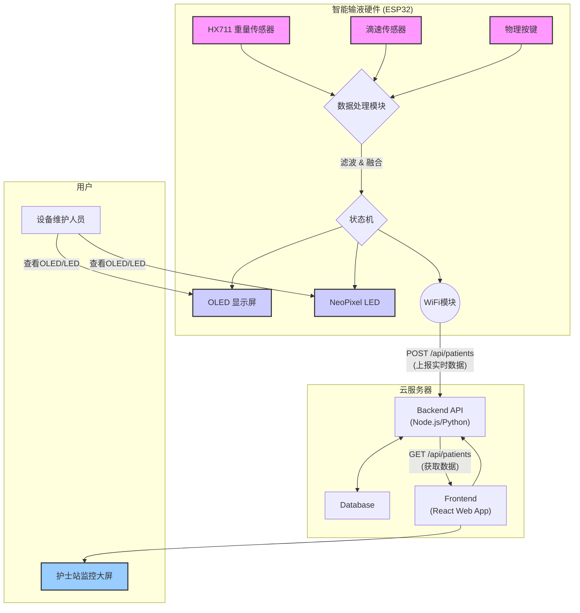

# 智能输液监护系统 (Smart Infusion PIO)

[](https://opensource.org/licenses/ISC)

这是一个基于 PlatformIO 开发的智能输液监护系统项目。该系统通过高精度传感器实时监测输液过程，利用卡尔曼滤波和数据融合算法提供准确的流速和剩余量预测，并通过多种方式（OLED屏幕、Web界面、云端API）进行数据显示和异常报警。

## 项目亮点

- **双重传感与数据融合**：同时采用重量和滴速两种维度进行测量，并通过扩展卡尔曼滤波(EKF)进行数据融合，极大地提高了输液速度和剩余量的测量精度与鲁棒性，有效避免了单一传感器因环境干扰或自身缺陷导致的测量失败。
- **全栈式监控方案**：项目不仅包含嵌入式设备端的固件，还提供了一套完整的前后端分离的Web应用（护士站监控中心），实现了从数据采集、处理、传输到可视化监控的闭环。
- **动态自适应滤波**：系统内置"快速收敛模式"，在输液初期采用更激进的滤波器参数，使读数能迅速稳定。输液稳定后则切换回正常参数，保证了测量的平稳性，兼顾了快速响应和稳定测量的双重需求。

## 系统架构



## 主要功能

*   **多传感器数据采集**:
    *   **重量传感器 (HX711)**: 实时测量输液袋的重量，精确到克。
    *   **滴速传感器**: 通过光电中断方式检测液滴滴落，精确记录每一次滴落事件。
*   **高级数据处理**:
    *   **卡尔曼滤波**: 分别对重量数据和滴速数据进行滤波，去除噪声，获得平滑、稳定的流速估算。
    *   **数据融合**: 融合重量传感器和滴速传感器的估算结果，提供更精确、更可靠的流速和剩余液体重量。
*   **实时状态监控**:
    *   **本地显示 (OLED)**: 在OLED屏幕上实时显示IP地址、剩余重量(g)、融合流速(g/s)和预计剩余时间(min)。
    *   **Web界面**: 提供一个基于 WebSocket 的实时 Web 监控界面，展示详细的原始数据、滤波后数据、融合数据和系统状态。
    *   **LED 状态指示**: 使用 NeoPixel RGB LED 通过不同颜色和闪烁模式指示系统当前状态（如：正常、异常、初始化、完成等）。
*   **智能告警与控制**:
    *   **输液异常检测**: 能自动检测滴速过慢或停止等异常情况，并触发报警。
    *   **完成提醒**: 在输液接近完成时发出提醒。
    *   **远程数据上报**: 定期将设备状态和输液数据通过 HTTP POST 请求上报到云端服务器。
    *   **自动夹断 (预留)**: 在检测到异常或输液完成时，可控制执行器（如舵机）夹断输液管（`auto_clamp`标志位）。
*   **系统模式**:
    *   **正常模式**: 稳定输液监控。
    *   **快速收敛模式**: 在输液开始时，采用更激进的滤波器参数，使系统读数能更快地收敛到真实值。
    *   **WPD 校准模式**: 支持通过 Web 界面启动和停止"克/每滴"(Weight-Per-Drop)的在线校准，以适应不同粘稠度的液体。
*   **用户交互**:
    *   **物理按键**: 提供"初始化/复位"和"异常清除"两个物理按键，方便现场操作。
    *   **Web指令**: 可通过Web界面发送指令，如启动/停止WPD校准、设置液体总量等。

## 硬件清单

| 组件             | 型号/规格                      | 连接引脚 (ESP32)               |
| ---------------- | ------------------------------ | ------------------------------ |
| 微控制器         | ESP32-S3 或类似开发板          | -                              |
| 显示屏           | 0.96寸 I2C OLED (SSD1306)      | SDA: `36`, SCL: `1`            |
| 重量传感器模块   | HX711 模块 + 压力传感器        | DT: `17`, SCK: `18`            |
| 滴速传感器       | 对射式红外传感器或类似装置     | DATA: `11` (中断引脚)          |
| 状态指示灯       | NeoPixel RGB LED (WS2812B)     | DATA: `48`                     |
| 物理按键         | 瞬时轻触开关 x2                | 初始化: `15`, 异常复位: `0`    |

## 软件与库

*   **开发环境**: [PlatformIO IDE](https://platformio.org/)
*   **框架**: Arduino
*   **主要库**:
    *   `WiFi`, `WiFiClient`, `HTTPClient`: 用于WiFi连接和网络通信。
    *   `WebSocketsServer`: 用于实现与Web界面的实时双向通信。
    *   `U8g2lib`: 强大的OLED显示库。
    *   `Adafruit_NeoPixel`: NeoPixel LED驱动库。
    *   `HX711`: HX711称重传感器库。
    *   `ArduinoJson`: 高效的JSON序列化/反序列化库，用于API数据交互。

## 项目结构

```
Smart_infusion_PIO/
├── .pio/                  # PlatformIO 核心文件 (自动生成)
├── .vscode/               # VSCode 工作区配置文件
├── data/                  # 数据文件
│   ├── collected_infusion_data/ # 采集的输液数据
│   └── fig/                 # 图片资源
├── docs/                  # 项目文档
├── include/               # 项目全局头文件
│   └── webpage.h          # 嵌入式网页HTML代码
├── lib/                   # 项目依赖的私有库 (当前为空)
├── scripts/               # 辅助脚本
├── src/                   # 源代码
│   ├── main.cpp           # 主程序逻辑
│   ├── WeightKalmanFilter.h
│   ├── WeightKalmanFilter.cpp
│   ├── DripKalmanFilter.h
│   ├── DripKalmanFilter.cpp
│   ├── DataFusion.h
│   └── DataFusion.cpp
├── test/                  # 测试代码
│   ├── test_data_fusion/
│   ├── test_drip_kf/
│   └── test_weight_kf/
├── .gitignore             # Git 忽略文件配置
├── platformio.ini         # PlatformIO 配置文件 (板子定义, 库依赖)
└── README.md              # 本文档
```

## 工作原理

系统的工作流程如下：

1.  **初始化**:
    *   系统启动，初始化硬件（OLED, NeoPixel, HX711）。
    *   连接到指定的 WiFi 网络，并启动 WebSocket 和 HTTP 服务器。
    *   执行一次`performSystemReinitialization()`，读取输液袋的初始重量，并将其作为基准。
    *   进入为时60秒的 **快速收敛模式**，以快速获得稳定的初始读数。

2.  **数据采集与处理**:
    *   **重量数据**: `handleWeightSensor()`函数在主循环中定期从 HX711 读取重量数据。原始数据首先经过异常值检测，然后送入 `WeightKalmanFilter` 进行滤波，输出平滑后的重量 `filt_weight_g` 和由重量变化计算出的流速 `flow_weight_gps`。
    *   **滴速数据**: `onWaterDropIsr()`中断服务函数捕捉每一次滴落，将时间戳存入一个循环队列。`handleDripRate()`函数从队列中取出时间戳，计算瞬时滴速 `raw_drip_rate_dps`，然后送入 `DripKalmanFilter` 进行滤波，得到平滑后的滴速 `filt_drip_rate_dps` 和基于WPD估算的流速 `flow_drip_gps`。

3.  **数据融合**:
    *   `handleDataFusion()`函数接收来自两个卡尔曼滤波器的流速和重量估算值。
    *   `DataFusion` 模块（一个扩展卡尔曼滤波器）将这两个来源的数据进行融合，得到最终的融合流速 `fused_flow_rate_gps` 和融合剩余重量 `fused_remaining_weight_g`。这提供了比单一数据源更准确和鲁棒的结果。

4.  **状态更新与输出**:
    *   根据融合后的数据计算预计剩余时间 `remaining_time_s`。
    *   通过 `updateDisplay()` 更新OLED屏幕上的显示内容。
    *   通过 `updateLedStatus()` 更新LED状态灯的颜色。
    *   `outputData()` 函数将详细的调试数据打印到串口，并通过WebSocket广播到所有连接的Web客户端。
    *   `uploadDataToServer()` 函数每10秒将关键数据（总容量、剩余容量、流速、剩余时间、系统状态等）打包成JSON格式，通过HTTP POST请求发送到指定的云端API。

5.  **异常处理**:
    *   `checkInfusionAbnormality()` 函数在 **正常模式** 下持续监控，如果在 `NO_DRIP_TIMEOUT_MS` (默认10秒) 内没有检测到滴落，系统状态会切换到 `INFUSION_ERROR`，LED变为红色闪烁，并立即上报异常状态。

## API与通信协议

### WebSocket

*   **端口**: 81
*   **服务器 -> 客户端**: 服务器以CSV格式的字符串形式，高频（约每秒一次）广播实时数据。格式如下：
    ```
    currentTime,rawWeight,filtWeight,rawFlowW,filtFlowW,drips,rawDps,filtDps,rawFlowD,filtFlowD,wpd,wpdCal,wpdLongCal,remWeightD,fusedFlow,fusedWeight,remTimeRawW,remTimeFiltW,remTimeRawD,remTimeFiltD,remTime,totalDrops,initWeight,wpd,progress,state
    ```
*   **客户端 -> 服务器**: 客户端可以发送以下字符串命令：
    *   `CALIBRATE_WPD_START`: 启动WPD长时校准。
    *   `CALIBRATE_WPD_STOP`: 手动停止WPD长时校准。
    *   `SET_TOTAL_VOLUME:<volume>`: 设置液体总量（例如 `SET_TOTAL_VOLUME:500`）。

### HTTP API (数据上报)

*   **方法**: `POST`
*   **URL**: `YOUR_SERVER_API_ENDPOINT` (例如: `http://your.server.com/api/patients`)
*   **Content-Type**: `application/json`
*   **请求体 (Body)**:
    ```json
    {
      "deviceId": "001",
      "totalVolume": 500,
      "remainingVolume": 250,
      "currentRate": 60,
      "estimatedTime": 25,
      "systemState": "NORMAL",
      "autoClamp": 0
    }
    ```
    *   `totalVolume`: 总容量 (ml)
    *   `remainingVolume`: 剩余容量 (ml)
    *   `currentRate`: 当前滴速 (滴/分钟)
    *   `estimatedTime`: 预计剩余时间 (分钟)
    *   `systemState`: 系统状态 (字符串)
    *   `autoClamp`: 夹断状态 (0: 未夹断, 1: 已夹断)

## 服务器端 (护士站监控中心)

`server` 目录中包含一个独立的全栈Web应用，作为护士站的输液监控中心。

### 概述

该应用提供了一个可视化的Web界面，用于集中监控所有连接的智能输液设备的实时状态。它由一个后端API服务和一个前端React应用组成。

### 技术栈

- **前端**:
    - **框架**: React.js
    - **UI 库**: Tailwind CSS
    - **打包工具**: Webpack (或类似工具)
- **后端**:
    - **运行时/框架**: Node.js + Express.js
    - **数据库**: SQLite
- **部署**:
    - **进程管理**: 使用 `tmux` 对前后端服务进行会话管理。

### 目录结构

```
server/
├── backend/         # 后端服务代码 (Node.js)
│   └── infusion-monitor.db  # SQLite 数据库文件
├── frontend/        # 前端React应用代码
│   ├── build/         # 生产环境构建输出
│   ├── public/        # 静态资源 (如 index.html)
│   ├── src/           # React 源码
│   ├── package.json   # 前端依赖配置
│   └── tailwind.config.js # Tailwind CSS 配置文件
├── App.js           # (应位于 frontend/src/) 前端主组件
├── package.json     # (顶层) Node.js项目配置文件
├── API.md           # 详细的后端API文档
└── start.sh         # 服务启动脚本 (使用tmux)
```

### 部署与运行

1.  **环境要求**: 服务器需要安装 `Node.js` (用于前端和后端)、`npm` 和 `tmux`。
2.  **启动服务**: 在服务器上，进入 `server` 目录并执行以下命令：
    ```bash
    bash start.sh
    ```
    该脚本会自动设置 `tmux` 环境，分别构建和启动前端与后端服务。
3.  **访问前端**: 在浏览器中打开 `http://<服务器IP>:<前端端口>` (具体端口需查看 `server/frontend` 配置) 即可访问监控中心。

### API 核心端点

后端服务提供了一套 RESTful API 用于数据交互。

- `POST /api/patients`: **设备数据上报**。ESP32设备通过此端点上报实时输液数据。
- `GET /api/patients`: **获取所有设备状态**。前端应用通过此端点获取所有患者的最新状态并展示。
- `PUT /api/patients/:deviceId`: **更新患者信息**。允许在护士站界面编辑患者姓名、床号等信息。

更详细的API说明、请求/响应格式和字段定义，请参阅 [`server/API.md`](./server/API.md) 文件。

## 安装与部署

本节主要介绍 **嵌入式设备** 的安装与部署。关于服务器端的部署，请参考"服务器端"章节。

### 硬件清单

| 组件             | 型号/规格                      | 连接引脚 (ESP32)               |
| ---------------- | ------------------------------ | ------------------------------ |
| 微控制器         | ESP32-S3 或类似开发板          | -                              |
| 显示屏           | 0.96寸 I2C OLED (SSD1306)      | SDA: `36`, SCL: `1`            |
| 重量传感器模块   | HX711 模块 + 压力传感器        | DT: `17`, SCK: `18`            |
| 滴速传感器       | 对射式红外传感器或类似装置     | DATA: `11` (中断引脚)          |
| 状态指示灯       | NeoPixel RGB LED (WS2812B)     | DATA: `48`                     |
| 物理按键         | 瞬时轻触开关 x2                | 初始化: `15`, 异常复位: `0`    |

### 软件与库

*   **开发环境**: [PlatformIO IDE](https://platformio.org/)
*   **框架**: Arduino
*   **主要库**:
    *   `WiFi`, `WiFiClient`, `HTTPClient`: 用于WiFi连接和网络通信。
    *   `WebSocketsServer`: 用于实现与Web界面的实时双向通信。
    *   `U8g2lib`: 强大的OLED显示库。
    *   `Adafruit_NeoPixel`: NeoPixel LED驱动库。
    *   `HX711`: HX711称重传感器库。
    *   `ArduinoJson`: 高效的JSON序列化/反序列化库，用于API数据交互。

### 部署步骤

1.  **安装 Visual Studio Code** 和 **PlatformIO IDE 扩展**。
2.  克隆本项目到本地。
3.  使用 VS Code 打开项目文件夹。
4.  修改 `src/main.cpp` 中的WiFi和服务器配置：
    ```cpp
    // WiFi配置
    constexpr const char* WIFI_SSID  = "your_wifi_ssid";
    constexpr const char* WIFI_PASS  = "your_wifi_password";
    // 服务器配置
    const char* API_BASE_URL = "YOUR_API_BASE_URL"; 
    ```
5.  修改 `platformio.ini` 文件，确保 `board` 配置与你的ESP32开发板型号匹配。
6.  连接硬件设备。
7.  点击 PlatformIO 工具栏上的 **Upload** 按钮编译并上传固件。
8.  点击 **Monitor** 按钮打开串口监视器查看设备输出。

## 使用说明

### 1. 硬件安装与准备
*   **固定设备**: 将整个设备稳固地放置在输液架上。
*   **挂载输液袋**: 将满载的输液袋挂在称重传感器的挂钩上。
*   **安装滴速传感器**: 将滴速传感器夹在输液管的墨菲氏滴管上，确保红外发射和接收端对准，以便准确捕捉液滴。

### 2. 开机与初始化
*   **接通电源**: 接通设备电源。系统启动时，NeoPixel LED会 **白色闪烁三次**，表示硬件自检完成。
*   **系统初始化**: 启动后，系统会自动连接WiFi。LED会显示 **黄色**，表示正在初始化。
*   **自动称重**: 初始化完成后，系统会自动读取当前输液袋的重量作为初始重量，并根据重量自动计算液体总量（如 480g 会计为 500ml）。
*   **开始输液**: 系统进入 **蓝色** 的 **快速收敛模式**。此时，**请立即开始输液**。系统会利用开始的60秒时间快速学习当前的输液流速，使读数尽快稳定。

### 3. 正常监控
*   **进入正常模式**: 60秒后，快速收敛模式结束，LED变为 **绿色**，系统进入稳定监控的 **正常模式**。
*   **OLED屏幕**: 屏幕会循环显示以下信息：
    *   IP地址，输液进度百分比
    *   剩余重量(g)，融合流速(g/s)，预计剩余时间(min)
*   **Web监控中心**:
    *   在电脑或手机浏览器中输入OLED上显示的IP地址，即可访问护士站Web监控界面。
    *   该界面提供更详细的实时数据图表、历史曲线和设备状态。

### 4. 状态与告警
| LED 状态      | 颜色     | 含义                 | 用户操作                               |
|---------------|----------|----------------------|----------------------------------------|
| 初始化中      | **黄色** | 正在连接WiFi，获取初始重量 | 等待                                   |
| 快速收敛      | **蓝色** | 输液初期，正在快速稳定读数 | 确保输液正常进行                     |
| 正常输液      | **绿色** | 一切正常                 | 无需操作                               |
| 输液异常      | **红色闪烁** | 超过10秒未检测到滴落     | 检查输液管是否堵塞或药液是否用尽   |
| 输液完成      | **白色常亮** | 剩余量已达标，输液结束     | 更换新的输液袋或关闭设备               |
| 初始化失败    | **红色常亮** | WiFi连接失败或传感器异常 | 检查WiFi密码或传感器连接，然后按复位键 |

### 5. 异常与恢复
*   **发生异常**: 当发生堵管、药液流尽等情况，系统会自动检测到并进入 **输液异常** 状态（红灯闪烁），同时会触发 `auto_clamp` 标志（如果已连接执行器）。
*   **手动恢复**:
    1.  处理完物理问题（如调整输液管、更换药液）。
    2.  按一下侧面的 **异常复位按键**。
    3.  系统将清除异常状态，LED恢复为 **绿色**，并继续监控。

### 6. 结束与重启
*   **输液完成**: 当系统检测到液体剩余量低于目标阈值时，会自动进入 **已完成** 状态（白灯常亮）。
*   **开始新的输液**:
    1.  取下空袋，挂上新的输液袋。
    2.  按一下正面的 **初始化按键**。
    3.  系统会重新执行初始化流程，开始一次全新的输液监控。
