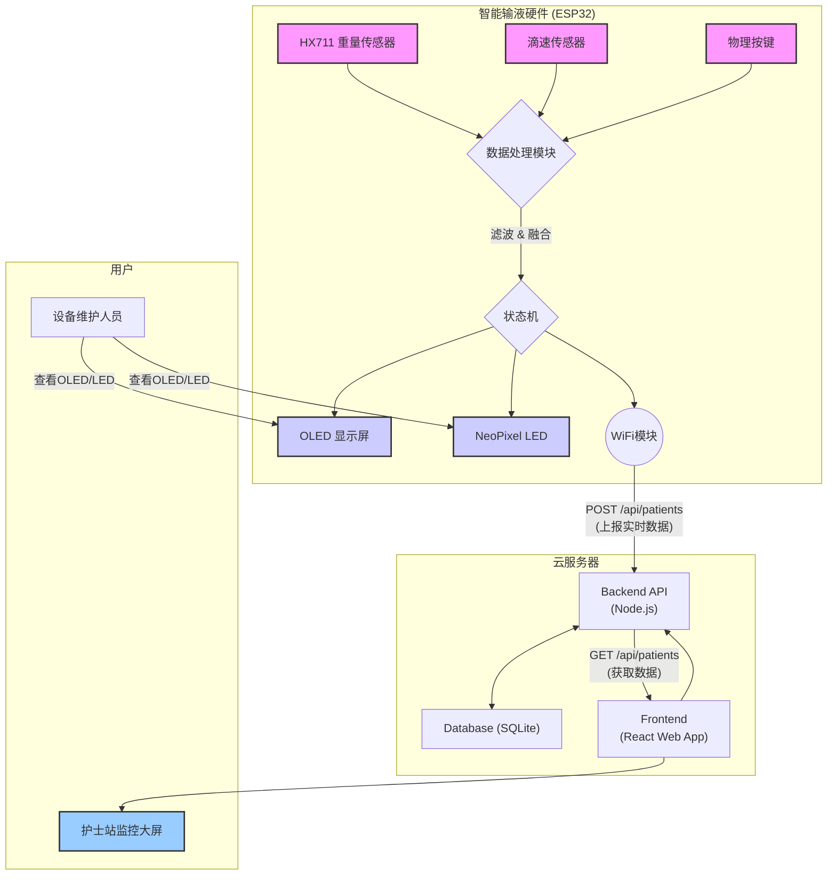

# 智能输液监护系统 (Smart Infusion PIO)

<p align="center">
  
  
  
  
  <a href="https://opensource.org/licenses/ISC"></a>
</p>

这是一个基于 PlatformIO 开发的智能输液监护系统项目。该系统通过高精度传感器实时监测输液过程，利用卡尔曼滤波和数据融合算法提供准确的流速和剩余量预测，并通过多种方式（OLED屏幕、Web界面、云端API）进行数据显示和异常报警。

## 目录
- [智能输液监护系统 (Smart Infusion PIO)](#智能输液监护系统-smart-infusion-pio)
  - [目录](#目录)
  - [🚀 项目亮点](#-项目亮点)
  - [🏗️ 系统架构](#️-系统架构)
  - [✨ 界面预览](#-界面预览)
  - [📋 主要功能](#-主要功能)
  - [📁 项目结构](#-项目结构)
  - [🖥️ 服务器端 (护士站监控中心)](#️-服务器端-护士站监控中心)
    - [技术栈](#技术栈)
    - [部署与运行](#部署与运行)
    - [API 核心端点](#api-核心端点)
  - [🛠️ 安装与部署 (嵌入式设备)](#️-安装与部署-嵌入式设备)
    - [硬件清单](#硬件清单)
    - [软件与库](#软件与库)
    - [部署步骤](#部署步骤)
  - [📖 使用说明](#-使用说明)
    - [1. 硬件安装与准备](#1-硬件安装与准备)
    - [2. 开机与初始化](#2-开机与初始化)
    - [3. 正常监控](#3-正常监控)
    - [4. 状态与告警](#4-状态与告警)
    - [5. 异常与恢复](#5-异常与恢复)
    - [6. 结束与重启](#6-结束与重启)
  - [🗺️ 未来规划 (Roadmap)](#️-未来规划-roadmap)
  - [📝 许可证](#-许可证)

---

## 🚀 项目亮点

- **双重传感与数据融合**：同时采用重量和滴速两种维度进行测量，并通过扩展卡尔曼滤波(EKF)进行数据融合，极大地提高了输液速度和剩余量的测量精度与鲁棒性，有效避免了单一传感器因环境干扰或自身缺陷导致的测量失败。
- **全栈式监控方案**：项目不仅包含嵌入式设备端的固件，还提供了一套完整的前后端分离的Web应用（护士站监控中心），实现了从数据采集、处理、传输到可视化监控的闭环。
- **动态自适应滤波**：系统内置"快速收敛模式"，在输液初期采用更激进的滤波器参数，使读数能迅速稳定。输液稳定后则切换回正常参数，保证了测量的平稳性，兼顾了快速响应和稳定测量的双重需求。

## 🏗️ 系统架构



## ✨ 界面预览


## 📋 主要功能

*   **多传感器数据采集**:
    *   **重量传感器 (HX711)**: 实时测量输液袋的重量，精确到克。
    *   **滴速传感器**: 通过光电中断方式检测液滴滴落，精确记录每一次滴落事件。
*   **高级数据处理**:
    *   **卡尔曼滤波**: 分别对重量数据和滴速数据进行滤波，去除噪声，获得平滑、稳定的流速估算。
    *   **数据融合**: 融合重量传感器和滴速传感器的估算结果，提供更精确、更可靠的流速和剩余液体重量。
*   **实时状态监控**:
    *   **本地显示 (OLED)**: 在OLED屏幕上实时显示IP地址、剩余重量(g)、融合流速(g/s)和预计剩余时间(min)。
    *   **Web界面**: 提供一个基于 WebSocket 的实时 Web 监控界面，展示详细的原始数据、滤波后数据、融合数据和系统状态。
    *   **LED 状态指示**: 使用 NeoPixel RGB LED 通过不同颜色和闪烁模式指示系统当前状态（如：正常、异常、初始化、完成等）。
*   **智能告警与控制**:
    *   **输液异常检测**: 能自动检测滴速过慢或停止等异常情况，并触发报警。
    *   **完成提醒**: 在输液接近完成时发出提醒。
    *   **远程数据上报**: 定期将设备状态和输液数据通过 HTTP POST 请求上报到云端服务器。
    *   **自动夹断 (预留)**: 在检测到异常或输液完成时，可控制执行器（如舵机）夹断输液管（`auto_clamp`标志位）。
*   **系统模式**:
    *   **正常模式**: 稳定输液监控。
    *   **快速收敛模式**: 在输液开始时，采用更激进的滤波器参数，使系统读数能更快地收敛到真实值。
    *   **WPD 校准模式**: 支持通过 Web 界面启动和停止"克/每滴"(Weight-Per-Drop)的在线校准，以适应不同粘稠度的液体。
*   **用户交互**:
    *   **物理按键**: 提供"初始化/复位"和"异常清除"两个物理按键，方便现场操作。
    *   **Web指令**: 可通过Web界面发送指令，如启动/停止WPD校准、设置液体总量等。

## 📁 项目结构

```
Smart_infusion_PIO/
├── .pio/                  # PlatformIO 核心文件 (自动生成)
├── .vscode/               # VSCode 工作区配置文件
├── data/                  # 数据文件
│   ├── collected_infusion_data/ # 采集的输液数据
│   └── fig/                 # 图片资源
├── docs/                  # 项目文档
├── include/               # 项目全局头文件
│   └── webpage.h          # 嵌入式网页HTML代码
├── lib/                   # 项目依赖的私有库 (当前为空)
├── scripts/               # 辅助脚本
├── src/                   # 源代码
│   └── main.cpp           # 主程序逻辑
├── test/                  # 测试代码
├── server/                # 服务器端全栈应用
│   ├── backend/
│   └── frontend/
├── .gitignore             # Git 忽略文件配置
├── platformio.ini         # PlatformIO 配置文件
└── README.md              # 本文档
```

## 🖥️ 服务器端 (护士站监控中心)

`server` 目录中包含一个独立的全栈Web应用，作为护士站的输液监控中心。

### 技术栈

- **前端**:
    - **框架**: React.js
    - **UI 库**: Tailwind CSS
    - **打包工具**: Webpack (或类似工具)
- **后端**:
    - **运行时/框架**: Node.js + Express.js
    - **数据库**: SQLite
- **部署**:
    - **进程管理**: 使用 `tmux` 对前后端服务进行会话管理。

### 部署与运行

1.  **环境要求**: 服务器需要安装 `Node.js` (用于前端和后端)、`npm` 和 `tmux`。
2.  **启动服务**: 在服务器上，进入 `server` 目录并执行以下命令：
    ```bash
    bash start.sh
    ```
    该脚本会自动设置 `tmux` 环境，分别构建和启动前端与后端服务。
3.  **访问前端**: 在浏览器中打开 `http://<服务器IP>:<前端端口>` (具体端口需查看 `server/frontend` 配置) 即可访问监控中心。

### API 核心端点

后端服务提供了一套 RESTful API 用于数据交互。

- `POST /api/patients`: **设备数据上报**。ESP32设备通过此端点上报实时输液数据。
- `GET /api/patients`: **获取所有设备状态**。前端应用通过此端点获取所有患者的最新状态并展示。
- `PUT /api/patients/:deviceId`: **更新患者信息**。允许在护士站界面编辑患者姓名、床号等信息。

更详细的API说明、请求/响应格式和字段定义，请参阅 [`server/API.md`](./server/API.md) 文件。


## 🛠️ 安装与部署 (嵌入式设备)

本节主要介绍 **嵌入式设备** 的安装与部署。关于服务器端的部署，请参考"服务器端"章节。

### 硬件清单

| 组件             | 型号/规格                      | 连接引脚 (ESP32)               |
| ---------------- | ------------------------------ | ------------------------------ |
| 微控制器         | ESP32-S3 或类似开发板          | -                              |
| 显示屏           | 0.96寸 I2C OLED (SSD1306)      | SDA: `36`, SCL: `1`            |
| 重量传感器模块   | HX711 模块 + 压力传感器        | DT: `17`, SCK: `18`            |
| 滴速传感器       | 对射式红外传感器或类似装置     | DATA: `11` (中断引脚)          |
| 状态指示灯       | NeoPixel RGB LED (WS2812B)     | DATA: `48`                     |
| 物理按键         | 瞬时轻触开关 x2                | 初始化: `15`, 异常复位: `0`    |

### 软件与库

*   **开发环境**: [PlatformIO IDE](https://platformio.org/)
*   **框架**: Arduino
*   **主要库**:
    *   `WiFi`, `WiFiClient`, `HTTPClient`: 用于WiFi连接和网络通信。
    *   `WebSocketsServer`: 用于实现与Web界面的实时双向通信。
    *   `U8g2lib`: 强大的OLED显示库。
    *   `Adafruit_NeoPixel`: NeoPixel LED驱动库。
    *   `HX711`: HX711称重传感器库。
    *   `ArduinoJson`: 高效的JSON序列化/反序列化库，用于API数据交互。

### 部署步骤

1.  **安装 Visual Studio Code** 和 **PlatformIO IDE 扩展**。
2.  克隆本项目到本地。
3.  使用 VS Code 打开项目文件夹。
4.  修改 `src/main.cpp` 中的WiFi和服务器配置：
    ```cpp
    // WiFi配置
    constexpr const char* WIFI_SSID  = "your_wifi_ssid";
    constexpr const char* WIFI_PASS  = "your_wifi_password";
    // 服务器配置
    const char* API_BASE_URL = "YOUR_API_BASE_URL"; 
    ```
5.  修改 `platformio.ini` 文件，确保 `board` 配置与你的ESP32开发板型号匹配。
6.  连接硬件设备。
7.  点击 PlatformIO 工具栏上的 **Upload** 按钮编译并上传固件。
8.  点击 **Monitor** 按钮打开串口监视器查看设备输出。

## 📖 使用说明

### 1. 硬件安装与准备
*   **固定设备**: 将整个设备稳固地放置在输液架上。
*   **挂载输液袋**: 将满载的输液袋挂在称重传感器的挂钩上。
*   **安装滴速传感器**: 将滴速传感器夹在输液管的墨菲氏滴管上，确保红外发射和接收端对准，以便准确捕捉液滴。

### 2. 开机与初始化
*   **接通电源**: 接通设备电源。系统启动时，NeoPixel LED会 **白色闪烁三次**，表示硬件自检完成。
*   **系统初始化**: 启动后，系统会自动连接WiFi。LED会显示 **黄色**，表示正在初始化。
*   **自动称重**: 初始化完成后，系统会自动读取当前输液袋的重量作为初始重量，并根据重量自动计算液体总量（如 480g 会计为 500ml）。
*   **开始输液**: 系统进入 **蓝色** 的 **快速收敛模式**。此时，**请立即开始输液**。系统会利用开始的60秒时间快速学习当前的输液流速，使读数尽快稳定。

### 3. 正常监控
*   **进入正常模式**: 60秒后，快速收敛模式结束，LED变为 **绿色**，系统进入稳定监控的 **正常模式**。
*   **OLED屏幕**: 屏幕会循环显示以下信息：
    *   IP地址，输液进度百分比
    *   剩余重量(g)，融合流速(g/s)，预计剩余时间(min)
*   **Web监控中心**:
    *   在电脑或手机浏览器中输入OLED上显示的IP地址，即可访问护士站Web监控界面。
    *   该界面提供更详细的实时数据图表、历史曲线和设备状态。

### 4. 状态与告警
| LED 状态      | 颜色     | 含义                 | 用户操作                               |
|---------------|----------|----------------------|----------------------------------------|
| 初始化中      | **黄色** | 正在连接WiFi，获取初始重量 | 等待                                   |
| 快速收敛      | **蓝色** | 输液初期，正在快速稳定读数 | 确保输液正常进行                     |
| 正常输液      | **绿色** | 一切正常                 | 无需操作                               |
| 输液异常      | **红色闪烁** | 超过10秒未检测到滴落     | 检查输液管是否堵塞或药液是否用尽   |
| 输液完成      | **白色常亮** | 剩余量已达标，输液结束     | 更换新的输液袋或关闭设备               |
| 初始化失败    | **红色常亮** | WiFi连接失败或传感器异常 | 检查WiFi密码或传感器连接，然后按复位键 |

### 5. 异常与恢复
*   **发生异常**: 当发生堵管、药液流尽等情况，系统会自动检测到并进入 **输液异常** 状态（红灯闪烁），同时会触发 `auto_clamp` 标志（如果已连接执行器）。
*   **手动恢复**:
    1.  处理完物理问题（如调整输液管、更换药液）。
    2.  按一下侧面的 **异常复位按键**。
    3.  系统将清除异常状态，LED恢复为 **绿色**，并继续监控。

### 6. 结束与重启
*   **输液完成**: 当系统检测到液体剩余量低于目标阈值时，会自动进入 **已完成** 状态（白灯常亮）。
*   **开始新的输液**:
    1.  取下空袋，挂上新的输液袋。
    2.  按一下正面的 **初始化按键**。
    3.  系统会重新执行初始化流程，开始一次全新的输液监控。

---

## 🗺️ 未来规划 (Roadmap)

- [ ] **用户认证系统**: 为护士站Web应用增加登录和权限管理功能。
- [ ] **历史数据分析**: 增加历史数据查询和图表分析功能，帮助回顾和分析输液过程。
- [ ] **功耗优化**: 针对ESP32设备，在待机或输液平稳期进入低功耗模式，延长电池续航。
- [ ] **物理夹管器集成**: 完成`auto_clamp`功能的硬件部分，实现真正的自动夹管。

## 📝 许可证

该项目根据 [ISC 许可证](https://opensource.org/licenses/ISC) 授权。
